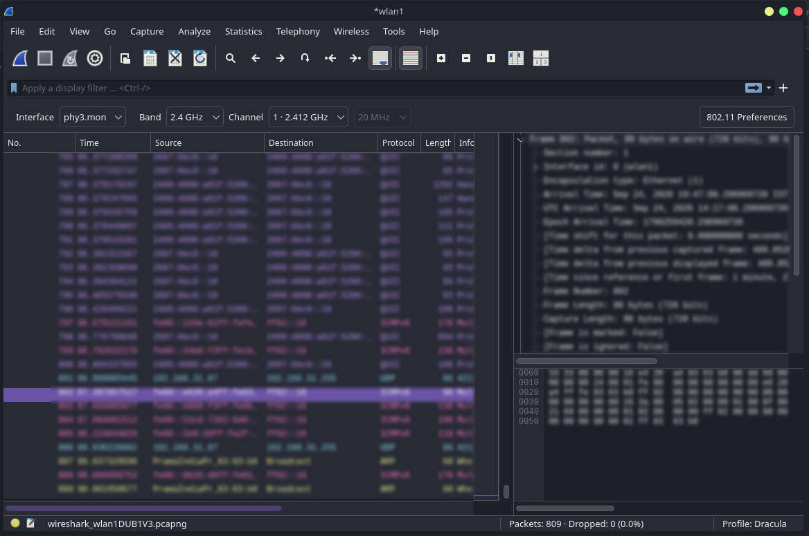

# Dracula for [Wireshark](https://www.wireshark.org)

> A dark theme for [Wireshark](https://www.wireshark.org).

## Install

All instructions can be found in [INSTALL.md](./INSTALL.md).

## Features

- Dracula color palette
- More than 187 protocol-aware coloring rules
- Dedicated highlighting for TCP analysis and web protocols
- Clear visibility for DNS, infrastructure, authentication, and security protocols
- Coverage for routing, network management, wireless, and industrial protocols
- Community-driven protocol additions

## Protocol coverage

This theme currently includes coloring rules for:

- TCP, UDP, IPv4, and IPv6
- HTTP, HTTP/2, HTTP/3, and QUIC
- TLS and DTLS
- DNS, mDNS, and LLMNR
- DHCP, DHCPv6, and ARP
- SSH, RDP, and VNC
- SMTP, IMAP, and POP
- SMB, SMB2, LDAP, and Kerberos
- BGP, OSPF, and RIP
- SIP, RTP, and RTCP
- MQTT, CoAP, and XMPP
- Wi-Fi, Bluetooth, and USB
- Modbus, DNP3, and Profinet
- Many more

## Team

This theme is maintained by the following person and a bunch of [awesome contributors](https://github.com/dracula/wireshark/graphs/contributors).

|  |
| ------------------------------------------------------------------------------------------------- |
| [Dhruv Meghwal](https://github.com/Anonymous-25)                                                  |

## Contributing

Found a missing protocol, an invalid display filter, or a compatibility issue? Want to improve the color mappings? Please [open an issue](https://github.com/dracula/wireshark/issues) or submit a pull request. Community contributions are welcome.

## Community

Join thousands of vampires using Dracula Theme around the world 🦇

- [X (Twitter)](https://x.com/draculatheme) and [Instagram](https://www.instagram.com/draculatheme) - Follow for tips, news, and fun.
- [Discord](https://draculatheme.com/discord-invite) - Hang out and chat with the rest of the clan.
- [GitHub Discussions](https://github.com/dracula/dracula-theme/discussions) - Ask questions and discuss issues.

## Dracula PRO

## License

[MIT License](./LICENSE)
